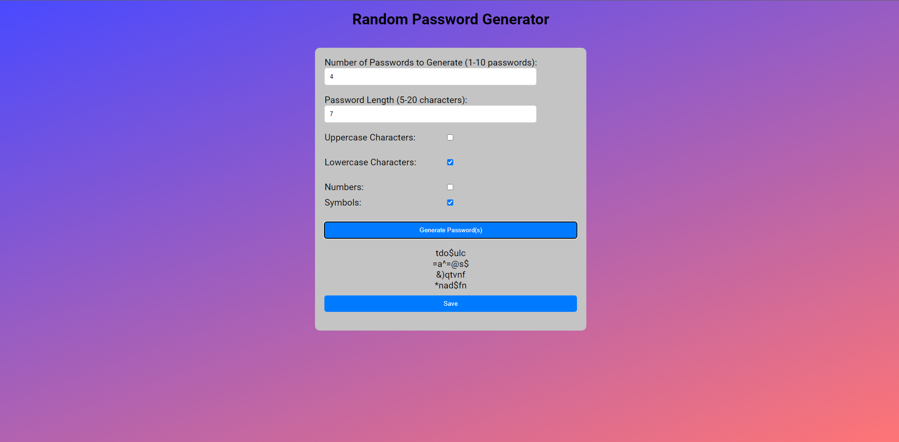

# Random Password Generator

Are you having trouble figuring out how to make complex passwords that are hard for people to guess? Then this web-based random password generator is for you! It can generate up to 10 passwords from a length of 5-20 characters at once, with options to include uppercase letters, lowercase letters, numbers, and symbols. After you're satisfied with the result, you have the option to download a list of the generated password(s) in the form of a text file to your computer!

## Features

- **Custom Number of Generated Passwords**: Choose how many passwords you would like to generate.
- **Custom Password Length**: Choose the length of the password(s) you would like to generate.
- **Character Set Criteria**: Choose which characters you would like to include in the password(s).
- **Save Button**: Save the list of generated password(s) to a text file.

## Files

- `index.html`: The HTML file that contains the web-based random password generator.
- `style.css`: The CSS file that contains the styling for the web-based random password generator.
- `index.js`: The JavaScript file that contains the logic for the web-based random password generator.
- `icon.png`: The image file that contains the icon for the web-based random password generator.

## How to Run

1. Download or clone the files in this repository.
2. Open `index.html` in the browser.
3. Create passwords by choosing the number of passwords you would like to generate, the length of the password(s) you would like to generate, and which characters you would like to include in the password(s).
4. Save the generated passwords as a text file on your computer.